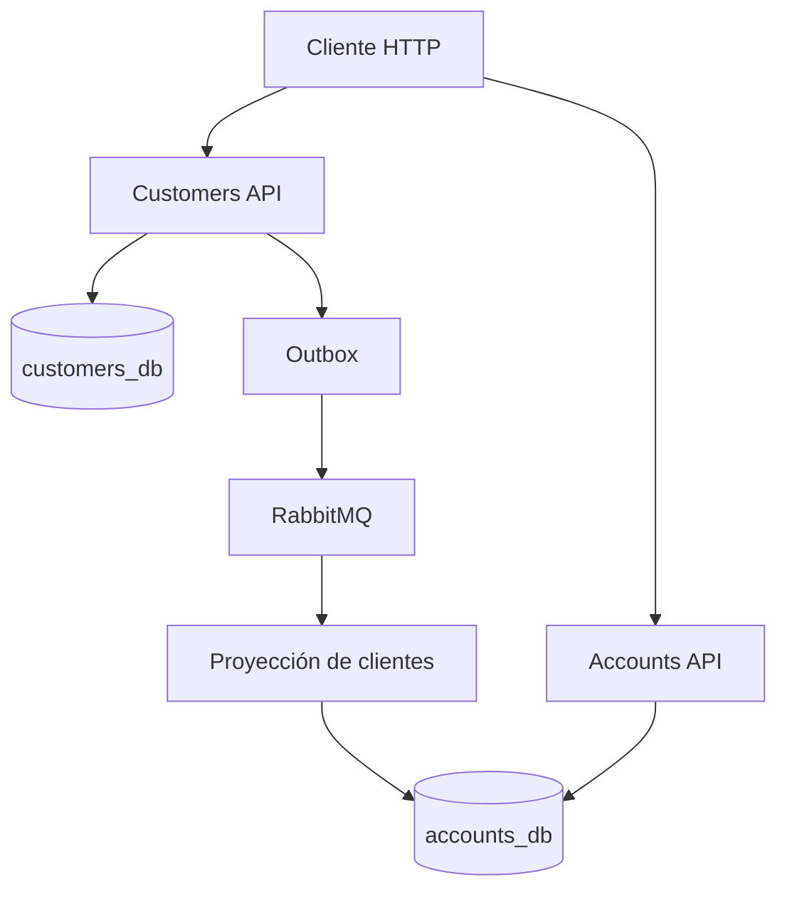

# Prueba técnica: arquitectura de microservicios bancarios

Solución implementada con **ASP.NET Core 8**, **Entity Framework Core**, **PostgreSQL**, **RabbitMQ**, **Docker Compose**, xUnit y Postman.

## Inicio rápido

Requisitos: Docker Desktop o Docker Engine con Compose.

```bash
docker compose up --build
```

Servicios disponibles:

| Servicio | URL |
| --- | --- |
| Clientes Swagger | http://localhost:8081/swagger |
| Cuentas Swagger | http://localhost:8082/swagger |
| RabbitMQ Management | http://localhost:15672 |
| PostgreSQL Clientes | localhost:5433 |
| PostgreSQL Cuentas | localhost:5434 |

Credenciales de desarrollo: `banking` / `banking_dev`.

Para detener la solución:

```bash
docker compose down
```

Si se modificaron los scripts SQL y se necesita recrear los datos de demostración:

```bash
docker compose down -v
docker compose up --build
```

> `down -v` elimina únicamente los volúmenes creados por este Compose. No debe usarse en un ambiente con datos reales.

## Arquitectura

La solución separa los dominios solicitados y evita que un microservicio consulte directamente la base de datos del otro.



### Microservicio de clientes

- Maneja `Persona` y `Cliente` mediante herencia.
- Expone CRUD de clientes.
- Protege contraseñas con PBKDF2, sal aleatoria y 100 000 iteraciones.
- Guarda los cambios y el evento en la misma transacción mediante el patrón Outbox.
- Publica eventos `ClientChangedEvent` en RabbitMQ.

### Microservicio de cuentas

- Maneja `Cuenta`, `Movimiento` y reportes.
- Mantiene una proyección local de clientes alimentada por RabbitMQ.
- No depende de llamadas HTTP al microservicio de clientes.
- Actualiza saldo y movimiento dentro de una transacción.
- Usa un token de concurrencia optimista para evitar sobrescrituras silenciosas.
- Devuelve `422` y el texto exacto **“Saldo no disponible”** cuando un retiro supera el saldo.

## Estructura de la solución

```text
src/
├── BuildingBlocks/Banking.Shared
├── Services/Customers
│   ├── Customers.Domain
│   ├── Customers.Application
│   ├── Customers.Infrastructure
│   └── Customers.Api
└── Services/Accounts
    ├── Accounts.Domain
    ├── Accounts.Application
    ├── Accounts.Infrastructure
    └── Accounts.Api
tests/
├── Customers.UnitTests
└── Accounts.IntegrationTests
database/
├── customers.sql
└── accounts.sql
postman/
└── BankingChallenge.postman_collection.json
```

Cada microservicio aplica una variante práctica de Clean Architecture:

- **Domain:** entidades, invariantes y reglas de negocio.
- **Application:** casos de uso, contratos, DTO y puertos.
- **Infrastructure:** EF Core, repositorios, PostgreSQL y RabbitMQ.
- **API:** controladores, configuración HTTP y manejo global de errores.

## Endpoints

### Clientes — `http://localhost:8081`

| Método | Ruta | Operación |
| --- | --- | --- |
| GET | `/api/clientes` | Listar clientes |
| GET | `/api/clientes/{id}` | Consultar cliente |
| POST | `/api/clientes` | Crear cliente |
| PUT | `/api/clientes/{id}` | Actualizar cliente |
| PATCH | `/api/clientes/{id}/estado` | Activar o inactivar |
| DELETE | `/api/clientes/{id}` | Eliminar cliente |

### Cuentas — `http://localhost:8082`

| Método | Ruta | Operación |
| --- | --- | --- |
| GET | `/api/cuentas` | Listar cuentas |
| GET | `/api/cuentas/{numero}` | Consultar cuenta |
| POST | `/api/cuentas` | Crear cuenta |
| PUT | `/api/cuentas/{numero}` | Actualizar tipo y estado |
| PATCH | `/api/cuentas/{numero}/estado` | Activar o inactivar |

### Movimientos y reportes

| Método | Ruta | Operación |
| --- | --- | --- |
| GET | `/api/movimientos` | Listar movimientos |
| GET | `/api/movimientos/{id}` | Consultar movimiento |
| POST | `/api/movimientos` | Registrar depósito o retiro |
| PUT | `/api/movimientos/{id}` | Corregir el último movimiento de una cuenta |
| GET | `/api/reportes?fechaInicio=2022-02-01&fechaFin=2022-02-28&clienteId={guid}` | Estado de cuenta |

Los valores positivos representan depósitos; los negativos, retiros. No existe `DELETE` para cuentas ni movimientos porque el requerimiento solicita CRU y porque eliminar transacciones comprometería la trazabilidad.

La actualización de movimientos se restringe al último movimiento de la cuenta. Así se satisface el CRU solicitado sin alterar de forma incoherente los saldos posteriores.

## Ejemplo: registrar un movimiento

```http
POST /api/movimientos
Content-Type: application/json

{
  "accountNumber": "225487",
  "value": 600,
  "date": "2026-09-21T12:00:00Z",
  "description": "Depósito"
}
```

Ejemplo de retiro sin saldo:

```json
{
  "type": "https://tools.ietf.org/html/rfc9110#section-15.5.21",
  "title": "Saldo insuficiente",
  "status": 422,
  "detail": "Saldo no disponible",
  "instance": "/api/movimientos"
}
```

## Comunicación asíncrona

1. Clientes guarda el cambio y un mensaje Outbox en PostgreSQL.
2. Un proceso en segundo plano publica el mensaje persistente en `banking.clients`.
3. Cuentas consume el evento desde `accounts.client-projection`.
4. El consumidor crea o actualiza `client_snapshots`.
5. Los mensajes no procesables se envían a `banking.dead-letter`.

La proyección aplica eventos solamente cuando su fecha es igual o posterior a la almacenada. Esto evita que un mensaje antiguo sobrescriba información más reciente.

La consistencia es eventual: después de crear un cliente pueden transcurrir aproximadamente dos segundos antes de crear su cuenta.

## Manejo de errores

Ambas API entregan `application/problem+json` y un `traceId`:

| Estado | Uso |
| --- | --- |
| 400 | Validación de negocio o entrada inválida |
| 404 | Recurso inexistente |
| 409 | Duplicado, cuenta inactiva o conflicto de concurrencia |
| 422 | Saldo no disponible |
| 500 | Error inesperado sin exponer detalles internos |

## Base de datos

`BaseDatos.sql` crea las dos bases y ejecuta los scripts de cada microservicio cuando se utiliza PostgreSQL directamente:

```bash
psql -U postgres -f BaseDatos.sql
```

Docker Compose ejecuta automáticamente `database/customers.sql` y `database/accounts.sql` en contenedores separados. Se incluyen los usuarios, cuentas y movimientos descritos en la prueba.

## Pruebas

Con .NET 8 SDK instalado:

```bash
dotnet restore
dotnet test
```

Se incluyen:

- Pruebas unitarias de la entidad `Cliente`.
- Prueba de integración del endpoint `GET /api/cuentas` con una base en memoria.
- Casos automatizados en Postman para creación, movimientos, saldo insuficiente y reporte.

Importe `postman/BankingChallenge.postman_collection.json`. Para probar un cliente creado desde Postman, espere dos o tres segundos antes de crear su cuenta debido a la sincronización asíncrona.

## Cobertura de requerimientos

| Funcionalidad | Implementación |
| --- | --- |
| F1 | CRUD Cliente; CRU Cuenta y Movimiento |
| F2 | Movimientos positivos/negativos, saldo actualizado y registro histórico |
| F3 | Error `Saldo no disponible` con HTTP 422 |
| F4 | Reporte JSON por rango de fechas y cliente |
| F5 | Pruebas unitarias de Cliente |
| F6 | Prueba de integración de Accounts API |
| F7 | Dockerfiles y Docker Compose para toda la solución |

## Rendimiento, escalabilidad y resiliencia

Implementado:

- Índices únicos y por campos de consulta.
- Operaciones asíncronas y `CancellationToken`.
- Contenedores independientes y bases aisladas.
- Outbox para no perder eventos después del commit.
- Cola durable, mensajes persistentes y dead-letter queue.
- Reintento de conexión del consumidor.
- Consumo idempotente por `ClientId` y control de eventos fuera de orden.
- Concurrencia optimista sobre el saldo de la cuenta.

Evolución recomendada para producción:

- API Gateway, autenticación OAuth 2.0/OIDC y autorización por scopes.
- Secret manager en lugar de credenciales en Compose.
- Migraciones EF Core versionadas en vez de `EnsureCreated`.
- Trazas distribuidas OpenTelemetry, métricas y logs centralizados.
- Política formal de reintentos, circuit breaker y alertas de dead letters.
- Paginación para listados y caché para reportes frecuentes.
- Pruebas de integración con PostgreSQL y RabbitMQ mediante Testcontainers.

## Decisiones importantes

- Se eligió RabbitMQ porque la sincronización entre clientes y cuentas es asíncrona y requiere entrega durable.
- Se usa una base por microservicio para conservar autonomía de datos.
- El reporte se genera en Cuentas usando su proyección local; no se realiza un join entre bases ni una llamada síncrona a Clientes.
- El saldo se mantiene en la cuenta para lectura rápida, mientras cada movimiento conserva el saldo resultante para auditoría.
- Las credenciales incluidas son exclusivamente de desarrollo.
